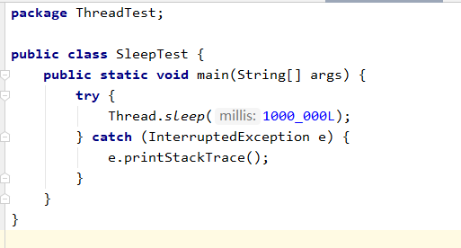
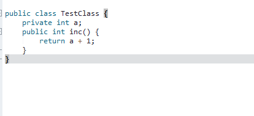
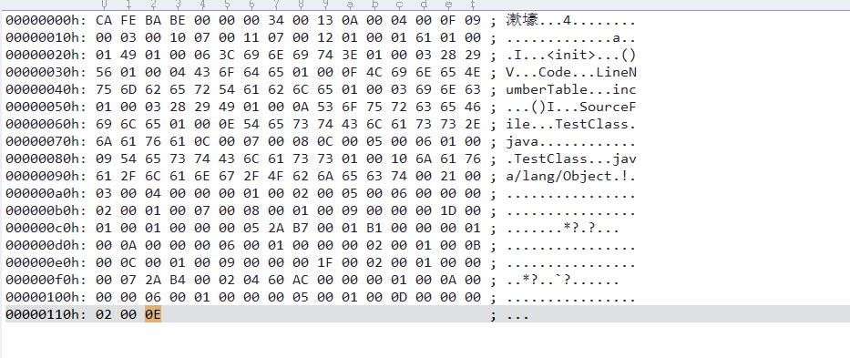
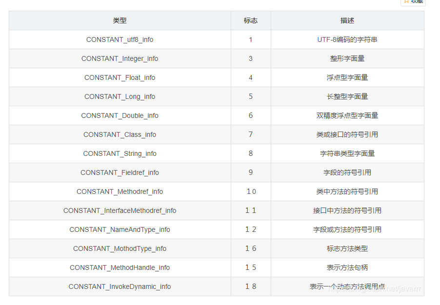
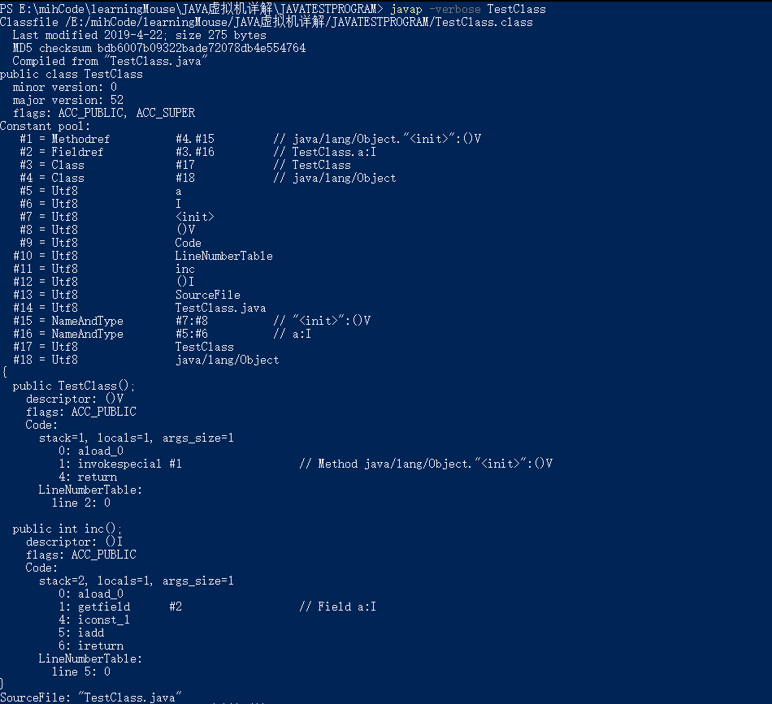

# 运行时数据区域

## 程序计数器

* 用来指示下一行字节码的行号

* 线程私有

* 对于native修饰的方法此区域为空

* 没有定义任何OutMemoryError

## 虚拟机栈

* 执行java字节码

* 线程私有， 生命周期和线程相同

* 每个方法在执行时都会创建一个栈帧， 包含局部变量表， 操作数栈， 动态链接， 方法出口等信息

* 栈深大于虚拟机允许深度抛出 StackOverflowError, 超过了虚拟机可扩展的最大内存抛出OutOfMemoryError异常

## 本地方法栈

* 执行native方法

* 同样会抛出StackOverflowError, OutOfMemoryError异常

## Java堆

* 所有线程共享

* 虚拟机启动时创建， 存放对象实例、数组（但不是绝对的）， GC管理的主要区域(又可分为新生代，老年代)

* 会抛出OutOfMemoryError异常

## 方法区

* 线程共享

* 存储已被加载的类信息（Class的相关信息）， 常量， 静态变量等

* 几乎不需要GC管理（有些虚拟机把这不会归到了永久代）

* 会抛出OutOfMemoryError异常

## 运行时常量池

* 方法区的一部分

* 存放编译期间生成的各种字面量和符号引用

* 会抛出OutOfMemoryError异常

## 直接内存

* 不属于JAVA运行时数据区， 比如JAVA NIO可以在堆外分配内存， 然后通过JAVA堆中的一个引用对堆外内存进行操作

* 会抛出OutOfMemoryError异常

# JAVA对象的创建

1. 首先在常量池中检查有没有已经存在这个对象所属类的引用， 如果没有就先加载类

2. 分配内存

3. 对对象进行必要的设置

# JAVA对象的内存布局

1. 对象头（header）

* 自身运行时的数据

* 类型指针

2. 实例数据， 真正存储有效信息大的部分

3. 对齐填充， 用于内存对齐

# java中的引用

* 强引用

* 软引用

* 弱引用

* 虚引用

# JAVA垃圾回收算法

1. 标记-清除算法

* 效率不高

* 会产生大量不连续的碎片， 需要进行碎片收集

2. 复制算法

思路：将GC管理的内存分为两份， 每次分配内存只是用其中一份， 使用的那一份内存满了后将其中存活的对象复制到另一份， 清除原来那分内存中的所有对象数据， 继续使用新的那一份内存；

实际应用：JAVA 堆中新生代的回收是最频繁的， 并且这段内存中绝大部分对象是要被回收的， 所以不需要按照1：1将内存平分， 可以将这部分内存的80%用作eden空间， 10%的用作survivor空间， 10%的用作eden、survivor中存活对象的拷贝空间；

3. 标记整理算法

与标记-清除算法相比多了整理的步骤， 在标记完要清除的对象后不是直接删除， 而是将存活的对象向一端移动， 之后直接清除另一端到内存结尾的所有对象；

4. 分代收集算法

就是将JAVA堆分为新生代和老年代， 新生代使用复制算法， 老年代使用标记-清除或者标记整理算法；

## CMS收集器

CMS(Concurrent Mark Sweep)收集器是一种以获取最短回收停顿时间为目的的收集器（因为JAVA多用在Web服务段， 服务端需要快的响应速度， 即短的停顿时间）， CMS是基于“标记-清除”算法实现的， 收集步骤：
1. 初始标记（CMS initial mark）
2. 并发标记（CMS concurrent mark）
3. 重新标记（CMS remark）
4. 并发清除（CMS concurrent sweep）
其中初始标记和重新标记需要“stop the world”，初始标记只是标记一下GC Roots能够直接关联到的对象， 速度很快， 并发标记能够和其他线程一起执行， 是GC Tracing的过程， 重新标记是为了修正并发标记期间用户程序继续执行而产生的标记变动， 这一过程比初始标记慢， 比并发标记快， 并发清除也可以和其他线程共同执行；

### CMS收集器的缺点

* 对CPU资源敏感， 因为需要开辟额外的线程用于垃圾回收， 所以当CPU资源充足时对用户线程的影响不是很大， 当CPU资源紧缺时对用户线程的影响比较明显
* CMS无法处理在并发清除阶段产生的垃圾， 并且由于在并发清除阶段其他线程还在执行， 所以不能等老年代几乎被填满了再进行垃圾回收， 需要预留足够的内存空间供其他线程使用；
* 标记-清除算法带来的大量内存碎片问题， 使得分配大对象时由于找不到合适的内存空间重新GC

## G1收集器

### G1收集器的优点

1. 并行与并发： 利用多核CPU的优势， 尽量减少“Stop the world”的时间；
2. 分代收集： 可以采用不同的方式处理新创建的对象和已经存货一段时间、熬过多次GC的旧对象；
3. 空间整合： 基于“标记整理”和“复制”算法， 不会产生大量的内存碎片
4. 可预测的停顿： 用户可以指定用户GC的时间

G1收集器与其他收集器相比， 不是将堆简单的分为新生代和老年代， 而是将整个JAVA堆划分为多个大小相等的独立区域（Region）， G1收集器再进行垃圾回收时回对每个Region的价值进行评定， 评定的依据是回收可以获得的空间和回收需要的时间， G1收集器优先收集价值高的Region， G1收集器的回收过程大致分为：

1. 初始标记
2. 并发标记
3. 最终标记
4. 筛选回收
其中筛选回收阶段就会就Region的价值进行评定再决定是否回收

# 虚拟机相关工具

## jps: 虚拟机进程状态工具

## jstat: 虚拟机统计信息监视工具

可以显示本地或者远程虚拟机进程中的类装载、内存、垃圾收集、JIT编译等运行数据

首先使用jps 获得需要监视的虚拟机进程

jstat -class 13836: 对进程号为13836的虚拟机进程的类装载、卸载数量以及装载所耗的时间进行统计；

jstat -gc 13836 250 20: 对进程号为13836的虚拟机进程的gc每隔250ms进行一次监视， 监视20次；

# Class 字节码文件

测试代码：

二进制字节码：

1. 头4个字节（CA FE BA BE）称表明这个文件是不是可以被虚拟机接受的class文件;

2. 第5，第6个字节是次版本号， 第7， 第8个字节是主版本号

3. 第9， 第10个字节， 偏移量为0x00000008, 表示常量池容量

这里有0x13个常量， 即19个常量， 但是常量计数是从1开始的， 0作为保留常量， 常量包括字面量和符号引用， 其中符号引用包括类或接口的全限定名称， 字段的名称和描述符， 方法的名称和描述符；

常量池中每一项都是一个表， 每个表的内容都不尽相同（除了第一项， 在下面常量表的描述中u1表示1个字节， u2表示2个字节， u4表示4个字节），  

4. 常量池内容：

0A表示类中方法的符号引用， 该表项结构：

* CONSTANT_Methodref_info

{
    tag u1;(0x0000000a)
    index u2; //指向声明方法的类描述符CONSTANT_Class_info的索引项（0x0000000b）
    index u2; //指向名称及类型描述符CONSTANT_NameAndType的索引项
    (0x0000000d)
}

* CONSTANT_Fieldref_info

{
    tag u1(0x0000000f);
    index u2; //指向声明字段的类或者接口描述符CONSTANT_CLASS_INFO的索引项(0x00000010)
    index u2; //指向字段描述符CONSTAANT_NAMEANDTYPE的索引项
    (0x00000012)
}

* CONSTANT_Class_info

{
    tag u1(0x00000014);
    index u2; //指向全限定名常量项的索引(0x00000015)
}

0x00000018: u2

* CONSTANT_utf8_info

{
    tag u1;
    length u2;utf-8编码的字符串占用的字节数(0x0000001b)
    bytes u1;长度为length的UTF-8编码的字符串(0x0000001d)
}

0x0000001e:tag u1

0x0000001b:length u2

0x0000001d:bytes u1

0x0000001e:tag u1

0x0000001f:length u2

0x00000021:bytes u1

0x00000022:tag u1

0x00000023:length u2

0x00000025:bytes u6

0x0000002b:tag u1

0x0000002c:length u2

0x0000002e:bytes u3

0x00000031:tag u1

0x00000032:length u2

0x00000034:bytes u4

0x00000038:tag u1

0x00000039:length u2

0x0000003b:bytes uf

0x0000004a:tag u1

0x0000004b:length u2

0x0000004d:bytes u3

0x00000050:tag u1

0x00000051:length u2

0x00000053:bytes u3

0x00000056:tag u1

0x00000057:length u2

0x00000059:bytes ua

0x00000063:tag u1

0x00000064:length u2

0x00000066:bytes ue

* CONSTANT_NameAndType_info 

{
    tag u1;(0x00000074)
    index u2; //指向该字段或方法名称常量项的索引(0x00000075)
    index u2; //指向该字段或描述符常量项的索引(0x00000077)
}

0x00000079:tag u1

0x0000007a:index u2

0x0000007c:index u2

* CONSTANT_utf8_info

0x0000007e:tag u1

0x0000007f:index u2

0x00000081:index u9

0x0000008a:tag u1

0x0000008b:index u16

0x0000008d:index u9

使用javap -verbose ClassFileName可查看常量池内容：

5. 访问标志， 包括这个Class是类还是接口， 是否定义为public类型， 是否定义为abstract类型， 是否声明为final等

0x0001 ACC_PUBLIC 是否为public类型

0x0010 ACC_FINAL 是否声明final

0X0020 ACC_SUPER JDK1.0.2之后编译出来的类必须为真

0x0200 ACC_INTERFACE 是否是一个接口

0X0400 ACC_ABSTRACT 是否是abstract

0X1000 ACC_SYNTHETIC 表明这个类并非由用户代码产生

0X2000 ACC_ANNOTATION 是否是一个annotation

0X4000 ACC_ENUM 是否是一个枚举

这里偏离地址为0x0000009d, 占u2， 为00 21

6. 类索引、父类索引、接口索引集合

紧接着为类索引：
偏移量： 0x0000009f u2 内容为00 03, 表示常量池中索引值为3的常量， 由图P4可以看出为TestClass

紧接着为父类索引：
偏移量：0x00000a1 u2 内容为00 04， 由图P4可以看出为java/lang/Object

紧接着为接口索引集合：
首先用两个字节表示由多少个接口， 然后在这个两个字节之后是常量池中的接口名称；
偏移量：0x000000a3 u2 内容为00 00， 所以没有接口；

7. 字段表集合

字段包括类字段(static修饰), 实例字段， 不包括方法中的局部字段

* 字段表结构：

容量计数器， 表示这个类有多少字段

fields_count u2 偏移量为0x000000a5， 内容为：00 01, 表示只有一个字段；

* 访问标记：

ACC_PUBLIC 0X0001

ACC_PRIVATE 0X0002

ACC_PROTECTED 0X0004

ACC_STATIC 0X0008

ACC_FINAL 0X0010

ACC_VOLATILE 0X0040

ACC_TRANSIENT 0X0080

ACC_SYNTHETIC 0X1000

ACC_ENUM 0X4000

access_flags u2 偏移量为0x000000a7， 内容为:00 02, 所以这个字段修饰符为private

* 字段名称

指向常量池中的一个索引

name_index u2 偏移量为0x000000a9， 内容为:00 05, 由p4图的此字段名称为“a”

* 字段描述符

表示此字段是哪种数据类型

标识字符：B，含义： byte;

标识字符：J，含义： long;

标识字符：C，含义： char;

标识字符：S，含义： short;

标识字符：D，含义： double;

标识字符：Z，含义： boolean;

标识字符：F，含义： float;

标识字符：V，含义： void;

标识字符：I，含义： int;

标识字符：L，含义： 一个对象;

对于数组， 每一维开始都是“[”

descriptor_index u2 偏移量为0x000000ab, 内容为：00 06， 由p4图得为I, 表示int;

* 属性计数器

attributes_count u2 偏移量0x000000ad, 内容为: 00 00， 所以没有属性表

* attribute_info

额外属性名称索引， 指向常量池中的一个常量

8. 方法表集合

如果子类没有使用@Override对父类得方法进行重载， 则父类方法不会出现在子类的Class文件中；

* 方法计数器

偏移量为0x000000af, 内容为:00 02， 由两个方法

* access_flags

ACC_PUBLIC 0x0001 

ACC_PRIVATE 0x0002

ACC_PROTECTED 0X0004

ACC_STATIC 0X0008

ACC_FINAL 0X0010

ACC_SYNCHRONIZED 0X0020 是否为synchronied

ACC_BRIDGE 0x0040 是否由编译器产生的桥接方法

ACC_VARARGS 0x0080 是否接受不定参数

ACC_NATIVE 0x0100 native

ACC_ABSTRACT 0x0400

ACC_STRICTFP 0x0800 是否为strictfp

ACC_SYNTHETIC 0x1000 是否由编译器自动产生

偏移量0x000000b1, 内容改为00 01, 所以为public

* name_index

指向常量池中一个常量， 偏移量为0x000000b3, 内容为：00 07由图p4得内容为<init>

* descriptor_index

指向常量池中一个常量，偏移量为0x000000b5， 内容为：00 08由图p4得内容为()V

* 属性计数器

偏移量0x000000b7, 内容为00 01， 表示有一个额外的属性表

* attribute_info

偏移量0x000000b9， 内容为00 09， 由图p4得此额外属性为Code， 表示此属性是方法得字节码描述

9. 属性表集合

与Class文件中对数据项的数目、顺序进行严格的限制不同， 属性表的限制稍微宽松， 没有对属性表中属性的顺序进行限制， 同时每个人可以添加自己的属性实现自己的编译器；

每个属性的合法结构：

attrubute_name_index u2 指向常量池的一个索引

attribute_length u4 属性值的长度

info u(attribute_length)

虚拟机规范中预定义的属性：

* Code

属性表结构：

attribute_name_index u2 固定为"Code", 偏移量为0x000000b9;

attribute_length u4 偏移量为0x000000bb, 内容为00 00 00 1d, 属性值有29个字节；

max_stack u2 偏移量为0x000000c1, 表示这个方法的栈深， 偏移量为0x000000bf, 内容为00 01;

max_locals u2 偏移量为0x000000c3, 表示局部变量所占的存储空间， 这里计算存储空间时时按Slot计算的， 每4字节算一个Slot， 对于不满4字节的数据类型， 如byte， 同样分配一个Slot， 这里的局部变量包括， 方法参数， 异常处理的参数， this；

code_length u4 偏移量0x000000c3, 表示字节码指令长度， 这里为00 00 00 05 表示接下来5个字节都是字节码指令， 其中包括字节码指令中应有的参数

code 这里为： 2A B7 00 01 B1

* ConstantValue

* Deprecated

* Exceptions

attribute_name_index u2

number_of_exceptions u2 可能抛出的异常数量

attritube_length u4

exception_index_table u2 有number_of_exceptions个， 指向常量池中CONSTANT_Class_info型常量的索引

* EnclosingMethod

* InnerClass

* LineNumberTable

* LovalVariableTable

用于描述栈帧中局部变量表中的变量与java源码中的变量之间的关系， 不是运行必须的属性。

attribute_name_index u2

attribute_length u4

local_variable_table_length u2

local_variable_table 是local_variable_info类型， 有local_variable_table_length个， local_variable_info结构如下：

start_pc u2

length u2

name_index u2

descriptor_index u2

index u2

start_pc和length描述这个局部变量的生命周期开始的字节码偏移量和覆盖范围的长度， 两者结合起来就是这个局部变量在字节码中的作用范围。
name_index和descriptor_index指向常量池CONSTANT_Utf8_info型常量的索引，代表局部变量的名称和这个局部变量的描述符。

* StackMapTable

* Signature

* SourceFile

* SourceDebugExtension

* Synthetic

* LocalVariableTypeTable

* RuntimeVisibleAnnotations

* RuntimeInisibleAnnotations

* RuntimeVisibleParameterAnnotations

* RuntimeInvisibleParameterAnnotatins

* AnnotationDefault

* BootstrapMethods

# 虚拟机类加载机制

## 类加载时机

解析过程可能在初始化之前或之后进行， 并且以下流程并不是依次进行的， 而是在一个过程执行中激活下一个过程

* 加载

1. 通过类的全限定名获取这个类的二进制字节流

2. 将这个字节流代表的静态存储结构转化为方法区的运行时数据结构

3. 在内存中生成一个Class对象， 作为方法去这个类各数据的访问入口

* 验证

* 准备

* 解析

* 初始化

* 使用

* 卸载

# 虚拟机字节码执行引擎

