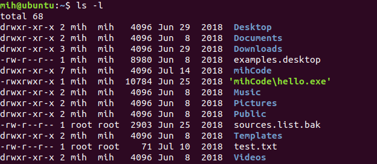
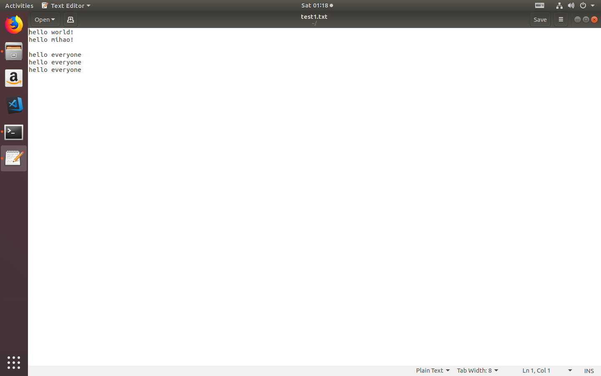
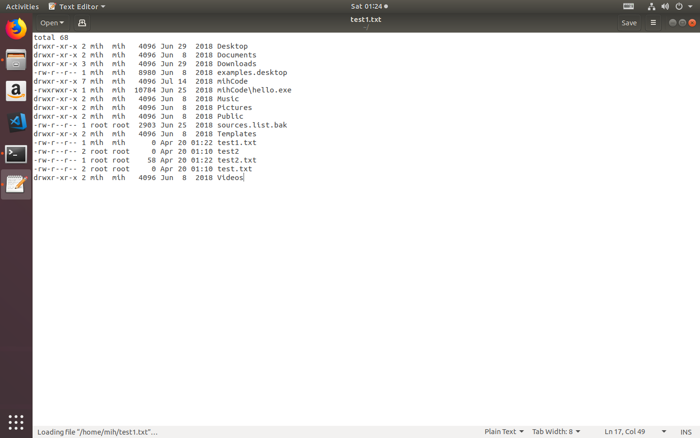
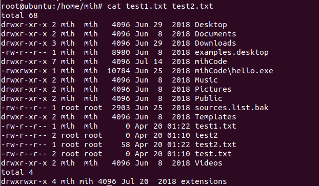
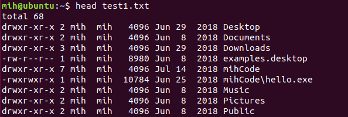
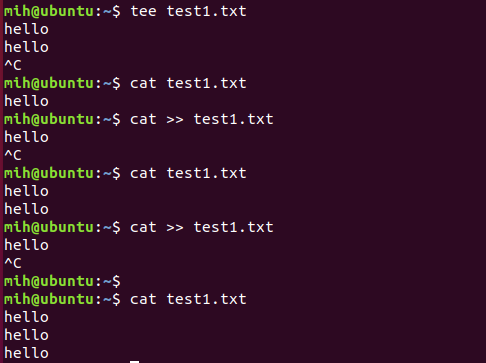
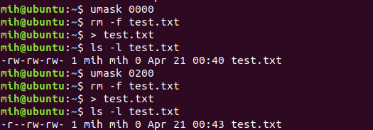

# shell指令

* pwd 显示当前工作目录

* ls -l

drwxr-xr-x 2 mih mih 4096 Jun 29 2018 Desktop

drwxr-xr-x: d表示这个文件是个目录， rwx表示文件所有者的权限， -xr表示文件所有者所在组其他用户的权限， r-x表示其他用户的权限

第一个mih 表示文件所属用户；

第二个mih 表示文件所属用户所属的组；

4096表示文件的大小；

Jun 29 2018表示文件最后修改的时间；

ls -l filename 可直接查看文件的信息

* file 查看文件类型

* less 查看文件内容（q键退出）

* cp 复制文件

cp [options] 文件名  目标文件

文件名支持通配符；

几个常用的操作：

1. -r: 递归的复制文件， 包括子文件

2. -u: 当目标文件比原文件旧或者目标文件是目录， 且目录中没有原文件时才复制；

3. -a: 复制文件所有属性；

* mv 移动或者重命名文件

宠用操作：

1. -u 将文件从一个目录移动到另一个目录只移动另一个目录中没有的或者目标目录中相应的更新的文件

mv file1 file2: 如果file2存在则覆盖file2， 如果file2不存在则相当于将file1重命名为file2， 无论怎么样file1都会消失；

mv dir1 dir2: 

* rm删除文件

常用操作：

1. -r： 递归的删除文件， 会删除目标文件中的子文件；

删除文件名带空格的文件： rm 'file name';

* ln 创建链接

ln file link 创建硬链接

ln -s file link 创建软链接（符号链接）

* 重定向

1. ">" : 此重定向会覆盖输出文件中的内容， 如果输入文件不存在则创建输出文件

原输出文件test1.txt的内容：

使用命令：root@ubuntu:/home/mih# ls -l  > test1.txt;

;

2. “>>” : 此重定向会在文件末尾进行添加;

3. 重定向中 0> 表示标准输入重定向， 1> 表示标准输出重定向， 2> 表示标准错误重定向；

* cat 将输入文件(可以有多个输入文件)重定向(默认是标准输出)， 如果没有输入文件， 则默认键盘为输入文件

cat file 将查看文件的内容

;

cat file1 file2 将查看file1 和 file2的内容

;

cat file1 file2 > file3 将file1 file2的内容输出到file3

* 管道 “|”

原test.txt中的内容：

因为cat 默认是标准输出， uniq用于去掉重复行， 默认是标准输入， 所以使用“|”将cat的输出与uniq的输入进行链接;

* wc 统计一个文件的行数、字数、字节数

* grep 用于匹配内容

首先ls指令将目录内容进行标准输出， “|” 将ls的输出与"grep"的输入进行连接， 匹配出包含“.txt”的文件；

* head/tail 打印文件的开头/结尾部分

head fileName 默认显示file的前10行内容， 使用“-n count”显示前count行内容

* tee file 从标准输入读取数据， 输出到file(覆盖原内容)， 同时输出到标准输出

* 参数扩展

1. “*” 路径扩展

2. “$” 运算符扩展

注意一定是两层括号

* which file 显示可执行文件的路径， 注意参数一定是一个可执行文件

* 之前使用的指令搜索

1. history 将显示最近使用的500条指令

2. 使用“!” + count， 将使用之前第count条指令；

3. ctrl + r将搜索之前使用的指令， 继续按ctrl + r将显示下一个匹配项， ctrl + j将搜索到的指令复制到终端， ctrl + c退出搜索

* id 获取用户身份标识的相关信息

* chmod 更改文件的权限（只有超级用户和文件所有者可以更改权限）

1. 八进制表示法: chmod 八进制数 fileName

2. 符号表示发： "u":usr, "g":group, "o":others, “a”:all, 默认是all "+"增加权限， “-”减少权限， “==”设置权限， “r”读权限， “w”写权限， “x”执行权限

* umask 设置文件的默认权限

首先一个文件默认的权限是“-rw-rw-rw-”， umask后跟4位八进制数（第一位用于设置特殊权限）， 后3位， 转化成二进制1出现的位置将取消该权限；

首先将文件的默认权限设置为“0000”, 此时权限为“-rw-rw-rw-”， 接着将默认权限设置为“0200”（八进制表示为“000，010，000，000”）， 删除源文件， 重新创建源文件，此时文件的权限变为“-r--rw-rw-”， 将“1”出现的位置的权限取消了

* chown chown [ower][:[group]]

chown ower fileName 将fileName的文件所有者改为ower

chown ower: 将fileName的文件所有者改为ower， 并把fileName所属的组改为ower所属的组

chown :group 将fileName的文件所属组改为group所属的组

chown ower:group 将fileName文件所有者改为ower， 将fileName所属组改为group

* passwd 更改用户密码

* “~”  ~用户名， 将显示该用户的主目录

* ps: 显示当前所有进程的运行情况

直接使用ps指令输出的内容很少， 可以使用 ps aux 将输出所有用户的所有进程

* top: 实时显示当前所有任务的资源占用情况

* 控制进程运行

以gedit程序为例

直接运行终端会等待程序执行结束

将程序设置为后台运行

将程序设置为前台运行， 首先使用jobs获得程序的任务号， 使用fg &任务号 将程序设置为前台运行

* jobs: 列出所有活动作业的状态信息

* bg: 设置后台中运行的作业

* fg: 设置在前台中运行的作业

* kill: 发出信号给某个进程

* killall: 杀死指定名字的进程

* shutdown: 关机或重新启动系统

* printenv: 打印部分或者全部的环境信息

printenv只能打印环境变量;

* set: 即会显示环境变量也会显示shell变量

* source .bashrc 命令终端强制重新读取.bashrc配置， 否则只能重新打开shell终端

* export: 将环境导出到随后要运行的程序中

* alias: 为命令创建一个别名

## 软件包系统

软件包系统提供用于安装、删除的低级工具和用于解决以来问题的高级工具， Debian类的系统（如Ubuntu）低级工具：dpkg, 高级工具： apt-get、aptitude; Red-Hat类系统低级工具rpm， 高举工具yum, 下面介绍Ubuntu下的指令

* 库源下安装软件包

apt-get update

apt-get install packageName

* 非库源下安装

dpkg -install package_file