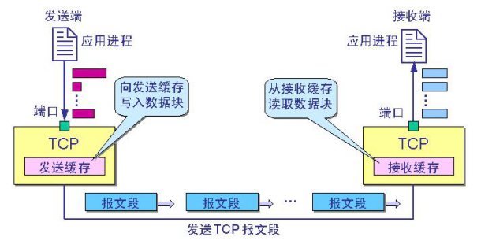
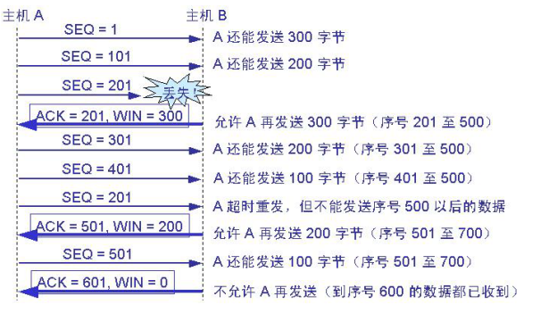
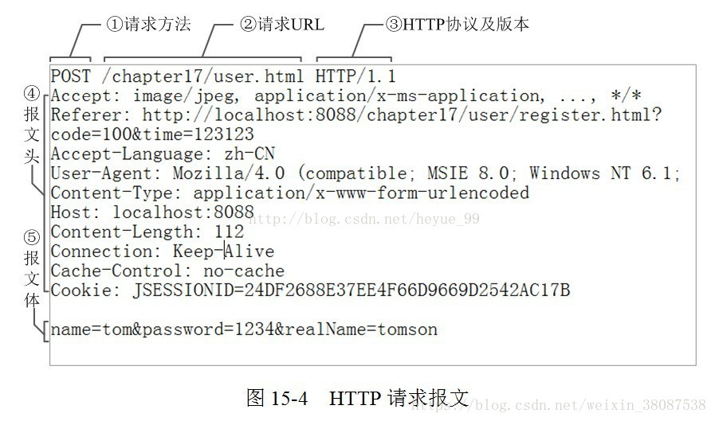
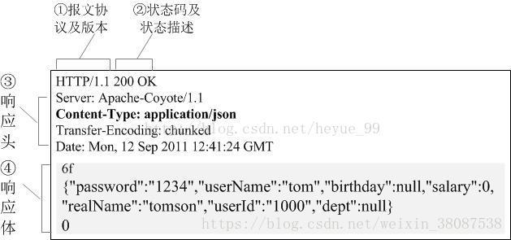
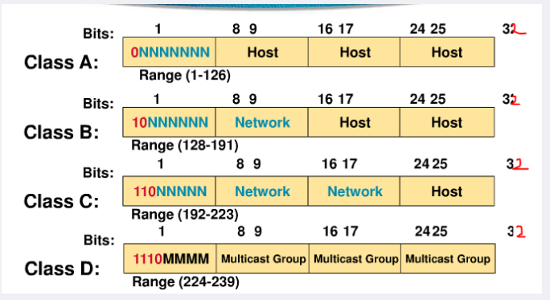

# TCP

https://www.cnblogs.com/lgx-fighting/p/9375858.html

https://blog.csdn.net/xiaofei0859/article/details/51058192

## TCP通过以下方式实现可靠性

1. 应用数据被分割成合适的报文段
2. TCP使用自适应的超时和重传策略
3. TCP对收到的数据进行重排序，以正确的顺序交给应用层；
4. TCP必须丢弃重复的数据；
5. TCP提供流量控制

## TCP报文格式

1. 源端口和目的端口各占2字节；
2. 序号字段：由于TCP时面向字节流的，需要对字节流的每个字节进行编号，并且TCP需要对字节流进行分段，所以这个字段表示此TCP报文段的第一个字节在整个TCP报文段的位置， 由于TCP最多可以对4GB的报文进行分段，所以4GB = 2 ^ 32, 所以需要32位；
3. 确认字段：期望收到的下一个报文的第一个字节的序号；
4. 数据偏移：4bit, 实际就是指TCP首部的长度，以32位为单位， 所以TCP首部最多有 (2 ^ 4 -1) * 4 = 60 字节
5. 保留字段：6bit， 目前置为0；
6. 紧急比特URG:当URG＝1时，表明紧急指针字段有效。它告诉系统此报文段中有紧急数据，应尽快传送(相当于高优先级的数据);
7. 确认比特ACK：只有当ACK＝1时确认号字段才有效。当ACK＝0时，确认号无效；
8. 复位比特RST：当RST＝1时，表明TCP连接中出现严重差错（如由于主机崩溃或其他原因），必须释放连接，然后再重新建立运输连接；
9. 同步比特SYN:同步比特SYN置为1，就表示这是一个连接请求或连接接受报文;
10. 终止比特FIN:用来释放一个连接。当FIN＝1时，表明此报文段的发送端的数据已发送完毕，并要求释放运输连接;
11. 窗口字段：可接受的最大字节数，由于TCP时可靠的双向传输，每次发送完数据后需要等待对方的ACK确认包，这就使双方传输的很慢，使用窗口发送方可以连续发送多个数据包而接受方只需要回复一个ACK，窗口字段就是发送方告诉接受方可接受的最多数据量；
12. 校验和：2字节，校验的范围包括首部和数据两部分，在计算校验和时需要在TCP报文段的前面加上12字节伪首部；

## TCP数据编号与确认

1. TCP协议是面向字节的。TCP将所要传送的报文看成是字节组成的数据流，并使每一个字节对应于一个序号。
2. 在连接建立时，双方要商定初始序号。TCP每次发送的报文段的首部中的序号字段数值表示该报文段中的数据部分的第一个字节的序号。TCP的确认是对接收到的数据的最高序号表示确认。接收端返回的确认号是已收到的数据的最高序号加1。因此确认号表示接收端期望下次收到的数据中的第一个数据字节的序号。
3. 为提高效率，TCP可以累积确认，即在接收多个报文段后，一次确认。

## TCP流量控制

TCP报文段首部中的窗口字段是给发送方设置的发送窗口的最大值， 在下图中接受方要求发送方的最大窗口是500字节， 发送方要发送900字节的数据， 切成了9个100字节大小的数据段， 未收到接受方的ACK确认报文时窗口不能移动

下图为发送方发送了400字节数据， 但只收到了前2个报文段的确认， 因此窗口向前移动了两个报文段的距离

下图为初始窗口为400时的发送与接受过程

## TCP慢启动和拥塞控制

发送端的主机在确定发送报文段的速率时，既要根据接收端的接收能力，又要从全局考虑不要使网络发生拥塞。因此，每一个TCP连接需要有以下两个状态变量：接收端窗口rwnd(receiver window) 又称为通知窗口(advertised window)。拥塞窗口cwnd(congestion window)。
接收窗口rwnd：这是接收端根据其目前的接收缓存大小所许诺的最新的窗口值，是来自接收端的流量控制。接收端将此窗口值放在TCP报文的首部中的窗口字段，传送给发送端。
拥塞窗口cwnd：是发送端根据自己估计的网络拥塞程度而设置的窗口值，是来自发送端的流量控制。

发送端的发送窗口的上限值应当取为接收端窗口rwnd和拥塞窗口cwnd这两个变量中较小的一个，即应按以下公式确定：
发送窗口的上限值＝Min[rwnd,cwnd]
当 rwnd < cwnd 时，是接收端的接收能力限制发送窗口的最大值。
当 cwnd < rwnd 时，则是网络的拥塞限制发送窗口的最大值。

慢启动过程：

1. 当TCP连接进行初始化时，将拥塞窗口置为1。图中的窗口单位不使用字节而使用报文段（MSS）。慢启动门限的初始值设置为 16 个报文段，即ssthresh = 16。

2. 发送端的发送窗口不能超过拥塞窗口cwnd和接收端窗口rwnd中的最小值。我们假定接收端窗口足够大，因此现在发送窗口的数值等于拥塞窗口的数值。在执行慢启动算法时，拥塞窗口cwnd 的初始值为1，发送第一个报文段M0。

3. 发送端收到ACK1（确认M0，期望收到M1）后，将cwnd从1增大到2，于是发送端可以接着发送M1和M2两个报文段。

4. 接收端发回ACK2和ACK3。发送端每收到一个对新报文段的确认ACK，就把发送端的拥塞窗口加倍。现在发送端的cwnd从2增大到4，并可发送M4—M6共 4个报文段。

5. 发送端每收到一个对新报文段的确认ACK，就把发送端的拥塞窗口加倍，因此拥塞窗口cwnd随着传输次数按指数规律增长。当拥塞窗口cwnd增长到慢开始门限值ssthresh时（即当cwnd = 16时），就改为执行拥塞避免算法，拥塞窗口按线性规律增长。

6. 假定拥塞窗口的数值增长到24时，网络出现超时（表明网络拥塞了）。

7. 更新后的ssthresh值变为12（即发送窗口数值24的一半），拥塞窗口再重新设置为1，并执行慢启动算法。

8. 当cwnd = 12时改为执行拥塞避免算法，拥塞窗口按按线性规律增长，每经过一个往返时延就增加一个MSS的大小。

## TCP 重传机制

简单来说TCP的超时重传是指TCP每发送一个报文段，就对这个报文段设置一个重传时间， 当重传时间到了仍没有收到ACK确认， 就重传一次这个报文， 这里面需要考虑的问题有：1. 如何计算往返时延；2. 如何设置超时重传时间；3. 发生多次重传后是否应该调整超时重传时间；

1. 计算往返时延（RTT）：
   记录每一个报文段发出的时间，以及收到相应的确认报文段的时间。这两个时间之差就是报文段的往返时延。将各个报文段的往返时延样本加权平均，就得出报文段的平均往返时延RTT。每测量到一个新的往返时延样本，就按下式重新计算一次平均往返时延RTT：平均往返时延RTT =a*(旧的RTT)+(1-a)*(新的往返时延样本)， 其中0 < a < 1；
2. 计算超时重传时间（RTO）
   计时器的RTO应略大于上面得出的RTT，即： RTO ＝ b * RTT这里b是个大于1的系数。若取b很接近于1，发送端可及时地重传丢失的报文段，因此效率得到提高。但若报文段并未丢失而仅仅是增加了一点时延，那么过早地重传反而会加重网络的负担。因此TCP原先的标准推荐将b值取为2。
3. 重新计算超时重传时间
   报文段每重传一次，就将重传时间增大一些：新的重传时间＝r*(旧的重传时间)，系数r的典型值是2 。当不再发生报文段的重传时，才根据报文段的往返时延更新平均往返时延RTT和重传时间的数值。实践证明，这种策略较为合理。

## 三次握手 & 四次挥手

https://zhuanlan.zhihu.com/p/40013850

https://blog.csdn.net/sinat_35297665/article/details/80979181

# UDP

# http

http://tools.jb51.net/table/http_header

http请求包括： 请求行、请求头、 请求体

http响应包括： 响应行、响应头、 响应体

## 请求头字段含义

1. reference: 表示这个请求是从哪个url跳过来的
2. Accept: 	指定客户端能够接收的内容类型
3. Cookie: HTTP请求发送时，会把保存在该请求域名下的所有cookie值一起发送给web服务器。
4. Content-Length: 请求的内容长度
5. Content-Type: 请求的与实体对应的MIME信息,如果是post请求,会有这个头,默认值为application/x-www-form-urlencoded，表示请求体内容使用url编码
6. Host: 指定请求的服务器的域名和端口号
7. Cache-Control: 指定请求和响应遵循的缓存机制
8. User-Agent: 浏览器通知服务器，客户端浏览器与操作系统相关信息

## 响应头字段含义

1. Location: 指定响应的路径，需要与状态码302配合使用，完成跳转
2. Content-Type: 响应正文的类型（MIME类型）
3. Content-Disposition: 通过浏览器以下载方式解析正文
4. Set-Cookie: 与会话相关技术。服务器向浏览器写入cookie
5. Content-Encoding: 服务器使用的压缩格式
6. Content-length: 响应正文的长度
7. Server: 指的是服务器名称

## 常用状态码

1. 1xx： 指示信息，表示请求已接收，继续处理
2. 2xx： 成功，表示请求已被成功接受，处理
   * 200 OK： 客户端请求成功
   * 204 No Content： 无内容。服务器成功处理，但未返回内容
3. 3xx： 重定向
   * 301 Moved Permanently： 永久重定向，表示请求的资源已经永久的搬到了其他位置。
   * 302 Found： 临时重定向，表示请求的资源临时搬到了其他位置
   * 303 See Other： 临时重定向，应使用GET定向获取请求资源。303功能与302一样，区别只是303明确客户端应该使用GET访问
   * 304 Not Modified： 表示客户端发送附带条件的请求（GET方法请求报文中的IF…）时，条件不满足。返回304时，不包含任何响应主体。虽然304被划分在3XX，但和重定向一毛钱关系都没有
4. 4xx： 客户端错误
   * 400 Bad Request： 客户端请求有语法错误，服务器无法理解
   * 401 Unauthorized： 请求未经授权，这个状态代码必须和WWW-Authenticate报头域一起使用。
   * 403 Forbidden： 服务器收到请求，但是拒绝提供服务
   * 404 Not Found： 请求资源不存在。比如，输入了错误的url
   * 415 Unsupported media type： 不支持的媒体类型
5. 5xx： 服务器端错误，服务器未能实现合法的请求
   * 500 Internal Server Error： 服务器发生不可预期的错误
   * 501 状态告诉客户端服务器不支持请求中要求的功能。例如，客户端执行了如PUT这样的服务器并不支持的命令
   * 503 Server Unavailable： 服务器当前不能处理客户端的请求，一段时间后可能恢复正常
   * 504 充当网关或代理的服务器，未及时从远端服务器获取请求
   * 505 服务器不支持请求的HTTP协议的版本，无法完成处理
# 浏览器中的缓存

# cookie & session

https://www.cnblogs.com/andy-zhou/p/5360107.html

cookie和session都是为了弥补http协议的无状态性，服务端需要知道多次http请求的用户是否为同一个用户；

## cookie机制

Cookie是客户端的解决方案， 是由服务端发送给客户端的一条特殊信息， 这些信息以文件的形式存放在客户端， 当客户端再次发送http请求时， 在http请求的头部就会携带cookie信息

# DNS

## host文件的作用

host文件中保存的内容为IP + 域名, 作用：

1. 加速域名解析， 由于在访问一个域名时首先要进行域名解析， 将域名解析成对应的IP地址， 使用host文件可以不请求域名服务器及逆行解析， 加速访问；
2. 方便局域网用户， 例如在公司的局域网中可能没有和外网相连， 并且如果输入局域网中其他计算机的IP可能比较麻烦， 这时候就可以将IP与一个别名及逆行绑定， 使用这个别名进行对其他计算机的访问；
3. 屏蔽一些不良网站， 比方对于一些不健康网站我们可以将其网站的域名与本机的IP进行绑定（127.0.0.1）;
   
# IP

## IP地址分类

私网IP段为：

* 10.0.0.0 ~ 10.255.255.255
* 172.16.0.0 ~ 172.31.255.255
* 192.168.0.0 ~ 192.168.255.255

