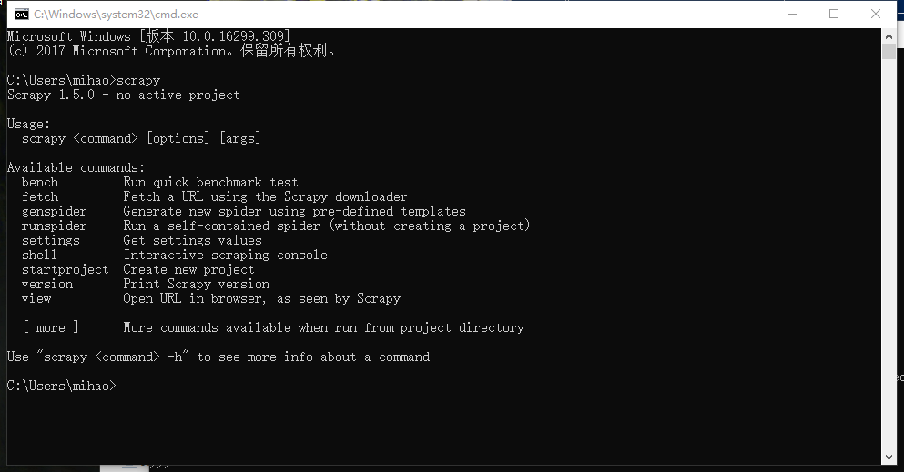

# scrapy爬虫

## 环境搭建
1. python3
2. scrapy及scrapy的依赖模块：lxml, twisted, win32Api
3. 环境搭建成功后如图


## 创建一个项目

```` 
scrapy startproject spider的名字
````
## 运行一个项目

````
scrpy crawl quotes
````

## shell数据爬取

1. scrapy shell "url地址"
2. 爬取html元素以及其中的内容


## python数据爬去

1. 使用scrapy创建项目 scrapy startproject tutorial


2. 运行项目 scrapy crawl quotes


## XPath表达式

1. 查找所有<a></a> : //a
2. 查找所有包含src属性的<a></a>: //a[@src]
3. 查找所有id="xx"的<a></a>: //a[@id="xx"]
4. 查找所有包含src, href的<a></a>: //a[contains(@src, @href)]
5. 查找所有<a></a>下所有的src属性值： //a//@src

## scrapy中的XPath表达式

1. 查找多有的<div>

````
divs = response.xpath('//div')
````
2. 查找所有<div>中的<p>

````
for p in divs.xpath('.//p')
    print(str(p.extract()))

````
或者：

````
for p in divs.xpath('p')
    print(str(p.extract()))
````

3. 条件查询

````
response.xpath('//div[@id=$val]/a/text()', val='xx')
````

## scrapy中的request和Respone

### request

````
class scrapy.http.Request(url, callback=None, method='GET', headers=None, body=None,cookies=None, meta=None, encoding='utf-8', priority=0,
dont_filter=False, errback=None, flags=None)
````

1. url(string) 请求的地址

2. callback(callable)  将使用此请求的响应（一旦下载）作为其第一个参数调用的函数。如果请求没有指定回调，parse()将使用spider的 方法。请注意，如果在处理期间引发异常，则会调用errback

3. method(string) 此请求的HTTP方法。默认为'GET'

4. meta(dict) 属性的初始值Request.meta。如果给定，在此参数中传递的dict将被浅复制。

### 使用meta在请求中传递参数

````
def parse_page1(self, response):
    item = MyItem()
    item['main_url'] = response.url
    request = scrapy.Request("http://www.example.com/some_page.html",
                             callback=self.parse_page2)
    request.meta['item'] = item
    yield request

def parse_page2(self, response):
    item = response.meta['item']
    item['other_url'] = response.url
    yield item
````

### meta特殊键

````
dont_redirect
dont_retry
handle_httpstatus_list
handle_httpstatus_all
dont_merge_cookies（参见cookies构造函数的Request参数）
cookiejar
dont_cache
redirect_urls
//用于执行请求的出站IP地址的IP。
bindaddress 
dont_obey_robotstxt
//下载器在超时前等待的时间量（以秒为单位）
download_timeout 
download_maxsize
/*
自请求已启动以来，用于获取响应的时间量，即通过网络发送的HTTP消息。此元键仅在响应已下载时可用。虽然大多数其他元键用于控制Scrapy行为，但这应该是只读的。
 */
download_latency
proxy
````

5. body(str或unicode) 请求体。如果unicode传递了a，那么它被编码为 str使用传递的编码（默认为utf-8）。如果 body没有给出，则存储一个空字符串。不管这个参数的类型，存储的最终值将是一个str（不会是unicode或None）。

6. headers(dict) 这个请求的头。dict值可以是字符串（对于单值标头）或列表（对于多值标头）。如果 None作为值传递，则不会发送HTTP头。

7. cookie(dict或list) 请求cookie。这些可以以两种形式发送

使用dict
````
request_with_cookies = Request(url="http://www.example.com",
cookies={'currency': 'USD', 'country': 'UY'})
````
使用list

````

````

## request子类


